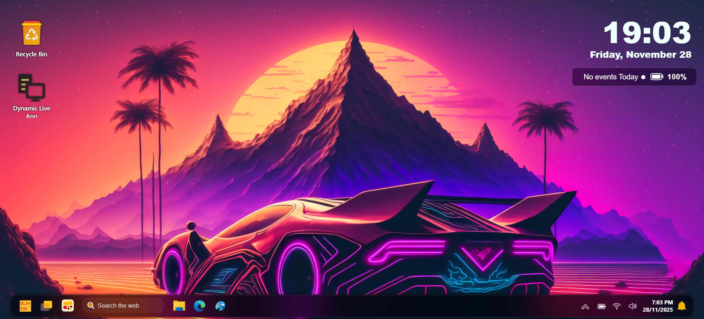
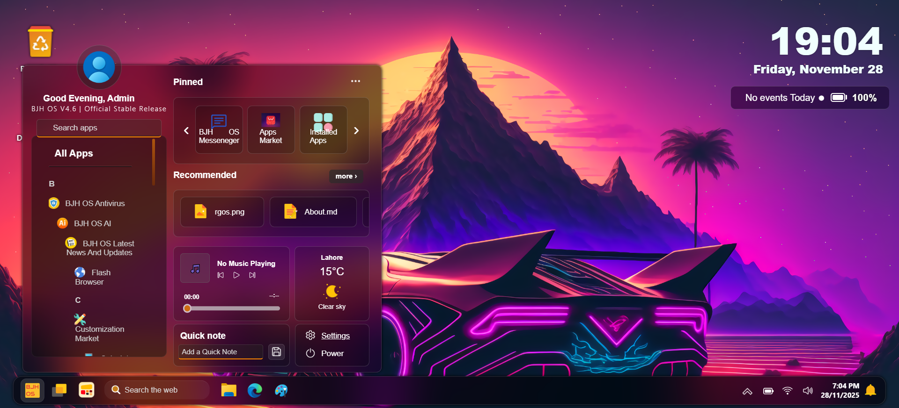
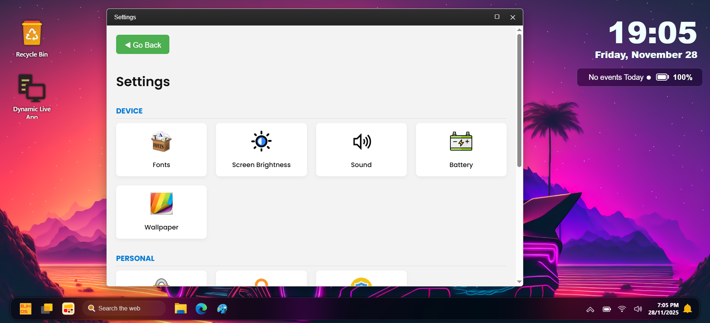
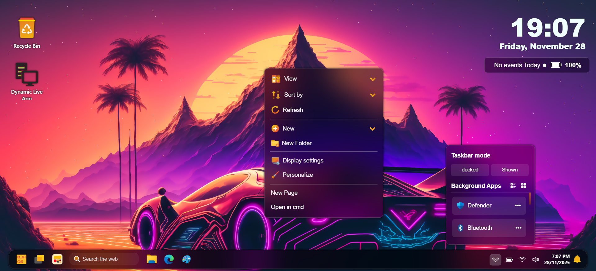

<h3 align="center">
  
</h3>

<h3 align="center">BJH OS — A Free, Open-Source, Web-Based Operating System</h3>

  <a href="https://haris16-code.github.io/BJH-OS/" target="_blank"><strong>Launch BJH OS
 </strong></a> Click Launch BJH OS to run BJH OS directly in your browser. Start exploring apps, features, and the full desktop experience — no download needed!
    
  <a href="https://github.com/Haris16-code/BJH-OS/blob/main/DEV_DOCS.md" target="_blank">Developer Documentation</a>
  ·
  <a href="https://discord.gg/SdDSUtCbX8" target="_blank">Discord Community</a>
  ·
  <a href="https://sourceforge.net/projects/bjh-os/" target="_blank">SourceForge</a>

 

<h3 align="center">Screenshots</h3>

  
  
  
  

**BJH OS** is a **browser-based operating system** developed using **pure HTML, CSS, and JavaScript** — no frameworks, no backend dependencies ⚙️🚫. It’s designed to give you real desktop OS, but in your web browser 🖥️✨

---

## 🚀 Key Features

- 🖼️ **Custom Desktop Environment**  
  Draggable, resizable windows with a familiar desktop layout. Apps now open inside movable, desktop-style windows with titlebars and close buttons. Windows can be maximized or restored by double-clicking the titlebar.
- 🖱️ **Smoother UI & Window Management**  
  Enhanced shadows, borders, and polished drag interactions give a modern desktop feel. Double-click the titlebar to maximize/restore windows, and enjoy smoother dragging and window interactions.

- 📦 **Built-in Apps**  
  Includes File Manager, Notes, Chat App (*ChatLink*), Settings, and more. Start menu & toolbar apps now open inside windows instead of new tabs, providing a seamless desktop experience.

- 🧩 **Modular Architecture**  
  Easily add new themes, wallpapers, and apps.

- 💾 **Persistent Data**  
  Uses `localStorage` to save your preferences and data between sessions.

- 🧑‍💻 **Powerful Web Terminal**  
  Run commands and control the OS with a built-in terminal — ideal for devs and power users.

- 🌐 **Remote Alerts & Update System**  
  Displays alerts and updates fetched from a remote JSON config. Automatic notifications ensure you never miss an important update.

- 🤖 **BJH OS AI**  
  Built-in assistant for smarter interactions and workflow automation.

- 🌐 **Flash Browser**  
  Lightweight, fast, and secure browser integrated into BJH OS.
  
- 🌍 **Worldwide Rollout**  
  Updates are being released globally in stages to ensure stability, avoid server overload, and provide a smooth installation experience.

🌟 BJH OS Apps Market - Feature Highlights
=========================================

Welcome to the next generation of web application deployment and discovery. The **BJH OS App Market** connects developers with users through a secure, high-performance, and visually stunning platform.

🚀 For Users: A Premium App Market Experience
--------------------------------------------

### 1\. Modern Glassmorphism UI

*   **Visual Excellence:** A fully responsive interface featuring modern glass-morphic cards, smooth transitions, and high-quality visuals.
    
*   **Theme Support:** Toggle between a crisp **Light Mode** and a sleek **Dark Mode**. Your preference is saved automatically.
    

### 2\. Intelligent Discovery

*   **Smart Search:** Instantly find apps, games, or tools using the real-time search bar.
    
*   **Categorization:** Browse through dedicated tabs for **"For You"**, **"Utilities"**, and **"Games"**.
    
*   **Smart Ranking:** The store automatically highlights trending apps based on download activity and freshness.
    

### 3\. Personal Library & Instant Launch

*   **One-Click Install:** Add apps to your library instantly. No complex installation wizards.
    
*   **Cloud Library:** Your apps are tied to your account. Log in from any device to access your installed software.
    
*   **Instant App Viewer:** Apps launch immediately within a secure, full-screen overlay without leaving the OS environment.
    

### 4\. Secure Authentication

*   **OTP Verification:** Accounts are secured via Email One-Time Passwords (OTP) during registration and login attempts from new contexts.
    
*   **Password Recovery:** Secure "Forgot Password" flow to regain access easily.
    

🛠️ For Developers: Powerful Deployment Tools
---------------------------------------------

### 1\. Zero-Downtime Updates

*   **Seamless Transitions:** When you update an app, the old version remains live for users until the new version is approved by admins. Users never experience broken links.
    
*   **Shadow Copy System:** Updates are staged safely in a review environment before merging with the live product.
    

### 2\. Drag & Drop Deployment

*   **Effortless Uploads:** Simply drag your project folder containing index.html and assets into the dashboard.
    
*   **Parallel Processing:** The upload engine handles multiple files simultaneously for lightning-fast deployments.
    

### 3\. Analytics & Insights

*   **Visual Data:** View beautiful charts showing download trends over the last 7 days.
    
*   **Performance Tracking:** Monitor total downloads directly from your dashboard card view.
    

### 4\. Communication & Support

*   **Issue Reporting:** Built-in ticketing system to report bugs or request help from Admins.
    
*   **Feedback Loop:** If an app is rejected, developers receive specific feedback/reasons from Admins directly on the dashboard to help them fix and resubmit.
    

🛡️ Security & Administration
-----------------------------

### 1\. Human-Verified Ecosystem

*   **Pre-Approval Workflow:** No app goes live without Admin review. This prevents malware, phishing, and low-quality content from reaching users.
    
*   **Content Safety:** Strict guidelines against NSFW and malicious content ensure a family-friendly environment.
    

### 2\. Real-Time Notifications

*   **Instant Alerts:** Users and Developers receive instant popup notifications and emails for critical events (App Approvals, Rejections, Account Status changes).
    
*   **Notification Center:** A built-in bell icon stores history of all system messages.
    

### 3\. Account Safety System

*   **Suspension Management:** Automated systems allow Admins to suspend violating accounts instantly.
    
*   **Appeals Process:** Banned users have a dedicated interface to submit appeals, which Admins can review and Approve/Reject with a single click.
    

⚡ Technical Performance
-----------------------

*   **Fast Load Times:** Optimized asset delivery and database queries ensure the store loads instantly.
    
*   **Robust Error Handling:** The system gracefully handles network issues, providing "Retry" options instead of crashing.
    
*   **Cloud Storage Integration:** Powered by high-speed cloud infrastructure for reliable asset hosting.
### 📢 Rollout Updates

- Released in **phases** to reduce server overload and prevent crashes.  
- Users gradually gain access as the rollout progresses.  
- Updates and notifications sent via **BJH OS system notifications** 

---
# Getting Started
## BJH OS Is Also Available as a hosted services at: [Live BJH OS](https://haris16-code.github.io/BJH-OS)
# 🛠️ How to Run BJH OS (Self-Hostable)

1. ⬇️ **Download the ZIP** from the [BJH OS MAIN REPOSITORY](https://github.com/Haris16-code/BJH-OS)  
2. 🗂️ **Extract** the ZIP file  
3. Open the extracted `BJH-OS` folder  
4. 🖱️ Open the main file by double-clicking `index.html` if it exists; otherwise, open `Setup.html`.  
5. 🌍 BJH OS will launch in your default browser  

> 🧑‍💻 No installation required — just open and go!  

---

## 💻 Run on Any Operating System

- **Windows, macOS, Linux:** Open `index.html` in any modern browser like Chrome, Firefox, Edge, or Safari.  
- **Android, iOS:** Use a mobile phone as BJH OS Self-Hosted Server. Install a local web server app (e.g., **Simple HTTP Server**, **Servers Ultimate**, **KSWeb**, Or Any Other Web Server App For Android, For iOS use **Any Web Server App for iOS**), copy the `BJH-OS-main` folder to the server’s root directory, start the server, and access BJH OS via your phone’s local IP address (`http://192.168.x.x`). This allows you to run BJH OS directly from your mobile device and share it with other devices on the same network.  
- **Other OS:** As long as there is a modern web browser, BJH OS will run.  

---

## 📱 Use Android or iPhone as a Server

1. Install a **local web server app** on your phone  
   - Android: **Simple HTTP Server**, **Servers Ultimate**, **KSWeb**, Or Any Other Web Server App For Android.
   - iOS: **Any Web Server App for iOS**  
2. Copy the `BJH-OS-main` folder to the server’s root directory.  
3. Start the server in the app.  
4. Open a browser on any device in the same network and enter your phone’s **local IP address** (e.g., `http://192.168.x.x/BJH-OS-main`).  
5. BJH OS will now run from your phone as a server.  

> ⚡ This allows you to host and test BJH OS anywhere without a PC.

---

## 🌐 Host as a Static Website

1. Upload the contents of the `BJH-OS` folder to any **static hosting service** (e.g., GitHub Pages, Netlify, Vercel).  
2. Set the root file as `index.html`.  
3. Access BJH OS via the provided URL and share it online.  

> ⚡ Hosting BJH OS lets you run it anywhere without needing to download the ZIP.
---
## 🧑‍💻 Developer Documentation

BJH OS 4.6 developer docs provide everything you need to **build, extend, and create apps or games** for the web-based desktop experience.  

**Highlights:**
- **Step-by-Step App & Game Development For BJH OS:** Learn how to create apps and games for BJH OS from scratch, including folder structure, required files, optional assets, and best practices.  
- **Project Structure:** Clear layout of core files and directories:
- **Uploading Apps And Games To BJH OS Apps Market:** Learn How To Upload Apps And Games To BJH OS Apps Market.
- **Window & Taskbar Systems:** Full guidance on draggable, resizable windows, maximize/restore behavior, taskbar icons, and in-window app launching.  
- **App Models:** Supports both built-in apps (pre-installed) and 3rd-party apps (installed via BJH OS TOOL).  
- **App Folder Template & Installer Flow:** Proper folder setup with required files (`index.html`, `favicon.ico`) and optional files (`style.css`, `app.js`, `constants.js`, assets). Includes installer instructions for seamless integration into BJH OS.  
- **Font Sync & Theming:** Apps automatically inherit the system font using `localStorage.selectedFont`. Supports custom themes and styling.  
- **Examples Included:** Ready-to-use apps like **Calculator** and **Snake** demonstrate best practices for structure, styling, and functionality.  
- **API & Programmatic Launching:** Use `window.openAppInWindow(url, title)` for in-window app launches and intercept same-origin `window.open()` calls.  
- **Testing & Troubleshooting:** Checklist for responsiveness, offline support, console errors, and common fixes. Tips for performance optimization and user experience.  
- **Developer Guidance & Best Practices:** Code style, accessibility, packaging/sharing apps, contributor workflow, and submitting apps to the BJH OS ecosystem.  

> For full instructions, examples, and detailed guidance:  
> 📄 **[Full Developer Documentation Here](DEV_DOCS.md)**

## 💻 BJH OS Discord Community

Join the **BJH OS Community** on Discord and connect with fellow users, developers, and enthusiasts! 🎉  
**[Join Now!](https://discord.gg/SdDSUtCbX8)**

We are building an active community around **BJH OS**, where you can:

- Get help with installation and troubleshooting  
- Share feedback and suggestions  
- Upload apps or games for the BJH OS Apps Market  
- Chat with other BJH OS users and developers  
- Participate in events, contests, and discussions

Whether you are a **developer, tester, or BJH OS fan**, there’s a place for you here!

---

## License

BJH OS (This Repository) is licensed under [AGPL-3.0](LICENSE).  
Some future premium features may have separate usage terms.

---
**Made with love in Pakistan ❤️**  
---  
**© 2025 BJH OS — by Muhammad Haris**
